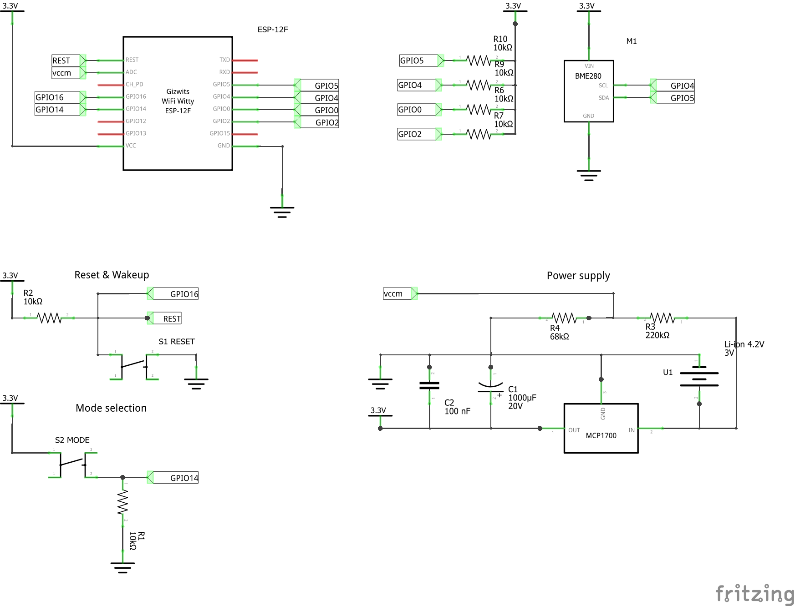
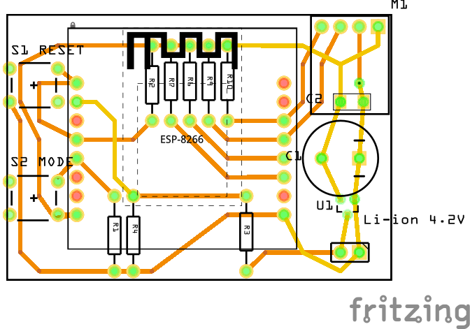

# WiFi Weather Station with ESP8266
Here I describe a Weather station that I have assembled in a few instances and located in different places of my house. The station is able to collect several readings periodically (temperature, humidity and optionally an air pressure) and publish it via radio network.

## Features
The Weather station has following features:
* radio communication via WiFi,
* support for BME280 (BMP280) and DHT sensor,
* deep sleep mode with additional "config" mode selector via momentary switch,
* suitable for battery powering,
* measures voltage level of power source (battery),
* can be powered with single 4.2V Li-ion cell due to integrated LDO voltage regulator and voltage stabilizer,
* usage of MQTT as integration backbone (in this case it integrates with Home Assistant-based central hub).

The Weather station design is based on ESP8266 module, namely the ESP12F variant. Alternatively, prototyping boards like Wemos D1 Mini can be used, at price of higher memory consumption thus shorter battery life.


## Project structure
Files in this repository are split into following three categories:
* `src\espeasy` - Esp Easy configuration and rules files,
* `src\fritzing` - Fritzing data file (schematics and PCB design),
* `src\hass` - Sample `yaml` definition (using "package" approach) for Home Assistant.

## Schematics
The schematics of the device has been split into several sections for clarity. See below for detailed description of the sections.

### BME variant


### DHT variant


### ESP8266 MCU
As the device uses bare-bone ESP module, there are several preconditions that must be fulfilled for MCU to start. This configuration is basically based on the one from Wemos D1 mini module. GPIO0, 2, 4 and CH_PD are pulled up via 10k resistors. GPIO15 is pulled down with 10k resistor. 

The device uses following pins of ESP-12F MCU:
* VCC, GND - for powering it up with 3.3V,
* RESET - for manual reset and wake up circuitry,
* GPIO4 - input from weather sensor (DHT11),
* GPIO4, GPIO5 - I2C communication with weather sensor (BME280),
* GPIO14 - input for mode selection switch,
* GPIO16 - for wake up circuitry (connected with RESET),
* ADC - analog input for voltage measurement circuitry.

### Power supply unit
The device uses single Li-ion 3.6 - 4.2V cell to power itself. The LDO voltage regulator (U1, Microship MCP1700-3302E/TO) lowers the voltage to the nominal level of 3.3V. This regular has a very low dropout voltage (178mV) and can deliver up to 250mA, which is sufficient for ESP8266 and DHT11 sensor. Two capacitors C1 and C2 are used to further stabilize the output voltage. This should ensure stable operation of ESP microcontroller during wake-up procedure.

It is also possible to power this device with 3xAA NiMH cells (3.6V nominal).

#### Note on using breadboards
The ESP8266 seems to have fairly high power consumption peak during a startup (it may exceed 200mA). If you use a cheap breadboard to prototype the power supply, and you'll try to plug ESP in, it is very likely the module won't boot properly. This is caused by the resistance of the breadboard itself and the connectors. It is okay to prototype power supply unit alone and test it without load, then mount it with soldered joints on prototype board and power the MCU that way (preferably using appropriate powering socket).

### Voltage measurement circuitry
The device measures Li-ion cell voltage via ADC analog input. Voltage readouts are used for both reporing and to implement cell discharge protection (the voltage of Li-ion cell should never drop below 3V). Because ESP 8266 module (here ESP-12F) accepts only 0-1V on ADC pin, I use voltage divider to reduce voltage before it reaches ADC input. Two resistors R3 and R4 with relatively high resistance (220K and 68K respectively) are used to ensure low current flow thus reduce power consumption.

### Mode selection, wake-up and reset circuitry
By default, the device connects to the WiFi network and MQTT server, gather sensor readings and publish them and then goes for deep sleep for predefined amount of minutes. 

Reset switch (S1) shorts reset pin and GND. Reset pin must be pulled up (R2).

To ensure HTTP access to the firmware (ESP Easy) there is a special mode of operation that can be chosen during power-up or reset. When S2 switch is pressed for a few seconds after power-up or reset, the device enters config mode in which no deep sleep is used. Config mode can be turned off by subsequent reset (mode selection switch must be in released state).

To ensure that ESP chip can wake up itself, RESET and GPIO16 pins must be connected.

### Sensor circuitry
#### BME variant
The BME280 variant is recommended one because of very low power consumption in standby mode (an order of uA), extended functionality (temperature, humidity and pressure) and outstanding precision and ranges. The BME280 is powered all the time and communicates with I2C bus with ESP 8266 microcontroller. Both signal lines are additionally pulled up with pair of 10K resistors.

#### DHT variant
The cheaper version involves DHT11 sensor. It sends data digitally via single signal line. It consumes 60-150uA when in standby mode (not measuring) and 0.5-2.5mA when measuring. In this particular project DHT11 is powered all the time, because it takes long time after powering this up to get reasonable readings. Depending on DHT11 model, it may require additional pull up register between data signal pin and VCC (10K should be just ok).

## Firmware
This project uses ESP Easy firmware, which replaces the original AT firmware of the ESP-12F.

### Flashing
We use normal_ESP8266_4M1M image without VCC support (VCC measurement is done via dedicated external circuit). For bare ESP-12F module you need a USB programmer with a special flash-mode circuit. You can build one with following description: 

https://github.com/maciejmalecki/esp8266-programmer

Assuming you have the programmer, and appropriate USB driver is installed, just follow the steps:

https://www.letscontrolit.com/wiki/index.php/Basics:_Connecting_and_flashing_the_ESP8266

Just remember to use appropriate voltage (3.3V) and image size (4M1M for ESP-12 modules, 1M1M for ESP-01 or ESP-07 modules).

### Configuration
After flashing restart the module and connect to the ESP_EASY access point via WiFi. Specify connectivity parameters suitable for your WiFi network.

You can download configuration from `src/espeasy/config.dat`. After uploading, you have to specify all credentials manually (including the ones for MQTT broker). Please note that there are separate configuration files per module type, that is: ESP-07 and ESP-12F. I have also noticed, that config files between different versions of ESP-12F (S/E/F) are not interchangeable, so are the configs between different versions of ESP Easy firmware.

Below there are manual steps to configure ESP Easy described. This should work no matter which version of ESP module as well ESP Easy firmware are used.

#### Configuration tab
The following configuration is valid only for BME variant. For DHT variant you can skip this configuration tab.

1. Enable I2C interface.
2. Configure I2C pins: GPIO4 for, GPIO5 for (opposite to the default settings).

#### Hardware tab
1. Configure GPIOx for input (mode selection button).

#### Devices tab
Configure device 2 as Analog Input device.
* Device: `Analog input - internal`
* Name: `vcc`
* Enabled: `yes`
* Calibration Enabled: `yes`
* Point 1: `0 = 0.000`
* Point 2: `977 = 3.930`

Note: the calibration may be different in case of different voltage divider used. You can easily calibrate the device by yourself my measuring battery voltage and matching it with "Current" value of the ADC input (which is a value between 0..1023).


Configure device 3 as Generic - Dummy Device:
* Device: `Generic - Dummy Device`
* Name: `dummy`
* Enabled: `yes`
* Output Data Type: `Single`
* Values #1 name: `mode`


##### BME variant
1. Configure device 1 as BMx280 sensor.


##### DHT variant
1. Configure device 1 as DHT sensor.

#### Advanced settings tab
Change the following settings:
* Rules: `yes`
* Old Engine: `yes`


#### Rules tab 
Paste content of `src/espeasy/bme/rules1.txt` (BME) or `src/espeasy/dht/rules1.txt` (DHT) into the rule are of `Rules Set 1`.

In order to change certain parameters of the device, the rules can be adjusted.
##### Sleep time
Sleep time is specified within event handler of `evtNext` custom event:
```
on evtNext do
  if [dummy#mode]=0
    DeepSleep,900
  else
    TimerSet,1,60
  endif
endon
```
Default value is 15 minutes (900 seconds). Change this value to order different sleeping time. Remember, that low values will make your battery life time shorter!

##### Config mode time
The device can be put into config mode by pressing `mode` button during startup/reset. To preserve battery and avoid situation, that device is accidentaly left in config mode, there is certain timeout of 10 minutes configured. To change this time modify second parameter of `TimerSet` command in `Timer 2` event handler:
```
on Rules#Timer=2 do
  TaskValueSet,3,1,[Plugin#GPIO#Pinstate#14]
  TimerSet,4,600
endon
```

##### Connection time out time
The device will send readouts and go into the deep sleep only when it connects to the MQTT broker successfully. There is certain timeout of 15 seconds - if connection cannot be obtained in that time, device goes to the sleep. This time can be adjusted in event handler of `evtStart` custom event - second parameter of `TimerSet,3` command at the end of the handler:
```
on evtStart do
  TaskValueSet,3,1,1
  Let,1,%unixday_sec%
  if [Plugin#GPIO#Pinstate#14]=1
    TimerSet,2,1
  else
    if [vcc#vcc]<3.40
      DeepSleep,4294
    endif
    TaskValueSet,3,1,0
  endif
  TimerSet,3,15
endon
```

##### Low voltage threshold
If the voltage drops under certain threshold (3.40V), the device sleeps immediately (to protect Li-ion from complete discharging). Threshold voltage can be adjusted in `evtStart` event handler (see above).

## Hardware assembly

### Bill of materials
#### BME unit
| #   | Code | Name        | Description                | Price (PLN) |
|----:|:----:|-------------|----------------------------|------------:|
|1    |ESP12F| MCU         | ESP-12F                    |12.99        |
|2    |      | ESP Board   | SMD to THT adapter board   |2.90         |
|3    |      | PCB         | Universal board 4x6cm      |2.99         |
|4    |BME   | BME280      | Temperature,humidity and pressure sensor|14.00     |
|5    |U1    | LDO Regulator|Microchip MCP1700-3302E/TO |1.59         |
|6    |R1    | Resistor    | 10K                        |0.02         |
|7    |R2    | Resistor    | 10K                        |0.02         |
|8    |R3    | Resistor    | 220K                       |0.02         |
|9    |R4    | Resistor    | 68K                        |0.02         |
|10   |R5    | Resistor    | 10K                        |0.02         |
|11   |R6    | Resistor    | 10K                        |0.02         |
|12   |R7    | Resistor    | 10K                        |0.02         |
|13   |R8    | Resistor    | 10K                        |0.02         |
|14   |R9    | Resistor    | 10K                        |0.02         |
|15   |R10   | Resistor    | 10K                        |0.02         |
|15   |C1    | Capacitor   | Electrolytic, 1000uF       |0.50         |
|16   |C2    | Capacitor   | Ceramic, 100nF             |1.39         |
|17   |S1    | Switch      | Tact switch                |0.23         |
|18   |S2    | Switch      | Tact switch                |0.23         |
|19   |      | Cell basket | 18650 cell basket          |2.19         |
|20   |      | Li-ion cell | 18650 4.2V 3400mA cell     |20.99        |
|21   |      | Case        | ABS case with ventilation  |10.00        |
|     |      |             |                   **Total**|**70.20**    |

#### DHT unit
| #   | Code | Name        | Description                | Price (PLN) |
|----:|:----:|-------------|----------------------------|------------:|
|1    |ESP12F| MCU         | ESP-12F                    |12.99        |
|2    |      | ESP Board   | SMD to THT adapter board   |2.90         |
|3    |      | PCB         | Universal board 4x6cm      |2.99         |
|4    |DHT1  | DHT11       | Temperature and humidity sensor|4.80     |
|5    |U1    | LDO Regulator|Microchip MCP1700-3302E/TO |1.59         |
|6    |R1    | Resistor    | 10K                        |0.02         |
|7    |R2    | Resistor    | 10K                        |0.02         |
|8    |R3    | Resistor    | 220K                       |0.02         |
|9    |R4    | Resistor    | 68K                        |0.02         |
|10   |R5    | Resistor    | 10K                        |0.02         |
|11   |R6    | Resistor    | 10K                        |0.02         |
|12   |R7    | Resistor    | 10K                        |0.02         |
|13   |R8    | Resistor    | 10K                        |0.02         |
|14   |R9    | Resistor    | 10K                        |0.02         |
|15   |C1    | Capacitor   | Electrolytic, 1000uF       |0.50         |
|16   |C2    | Capacitor   | Ceramic, 100nF             |1.39         |
|17   |S1    | Switch      | Tact switch                |0.23         |
|18   |S2    | Switch      | Tact switch                |0.23         |
|19   |      | Cell basket | 18650 cell basket          |2.19         |
|20   |      | Li-ion cell | 18650 4.2V 3400mA cell     |20.99        |
|21   |      | Case        | ABS case with ventilation  |10.00        |
|     |      |             |                   **Total**|**60.98**    |

### PCB design

#### BME variant


#### DHT variant


### Note on power consumption
With ESP8266 removed, the circuit draws roughly 60uA of current. The DHT11 itself draws 50uA in idle mode. The remaining 10uA is consumed by voltage regular and voltage divider.

The ESP-07/12 modules consume roughly 70mA in operational mode and only 10-20uA in deep sleep mode. To reduce time in operational mode (thus increase battery life time), following actions can be taken:
* disable DHCP and use fixed IP,
* extend sleep time (time is hardcoded in rules).

Additional recommendation: leave config mode as soon as possible by restarting the unit. There is a protection which turns of config mode automatically after 10 minutes. There is a protection that turns the unit into deep sleep permanently if voltage on Li-ion battery drops below 3.4V (to preserve battery from excessive discharging and ESP module from running on too low voltage). Both protections are implemented in rules.

### Running the device
Properly assembled and configured device runs as soon as it is powered up (just plug the power source into the motherboard). By default, it runs in a production mode, where it:
1. Connects to the WiFi network.
2. Connects to the MQTT broker.
3. Gathers measurements and sends it as MQTT messages.
4. Goes into the deep sleep for specified amount of time (by default it is 900 seconds = 15 minutes).
5. After Wake-Up it goes into 1.

It is not possible to access Esp Easy UI in a production mode. In order to access the UI, you have to put the device into the configuration mode. This can be achieved via following procedure:
1. Press `S2` button.
2. While `S2` is pressed, reset the device by brief press of `S1` button.
3. Keep `S2` pressed for a short while (few seconds).
Now you can access the UI via web browser. Configuration mode can be disabled by pressing Reset (S1) button while S2 button is released. Remember not to keep the device in configuration mode too long, because it will drain the battery in few hours.

At any time you can reset the device with brief press of `S1` button.