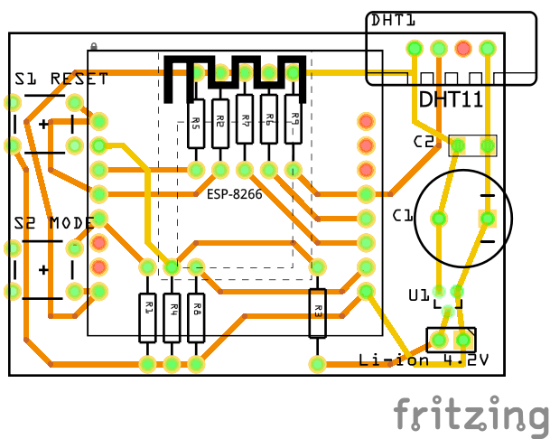

# WiFi Weather Station with ESP8266
Here I describe a Weather station that I have assembled in few pieces and located in different places of my house. The station is able to collect several readings (temperature, humidity and optionally an air pressure) periodically and publish it via radio network.

The Weather station has following features:
* radio communication via WiFi,
* support for DHT sensor,
* deep sleep mode with additional "active" mode selector via momentary switch,
* suitable for battery powering,
* measures voltage level of power source (battery),
* can be powered with single 4.2V Li-ion cell due to integrated LDO voltage regulator and stabilize,
* usage of MQTT as integration backbone (in this case it integrates with Home Assistant-based central hub).

The Weather station design is based on ESP8266 module, namely the ESP12F variant. Alternatively, prototyping boards like Wemos D1 Mini can be used, at price of higher memory consumption thus shorter battery life.

Let's take a look at the overall architecture of the system, where Weather station coexists.

## Power supply

## Schematics

## Firmware

## Hardware assembly

### Bill of materials

### PCB design

